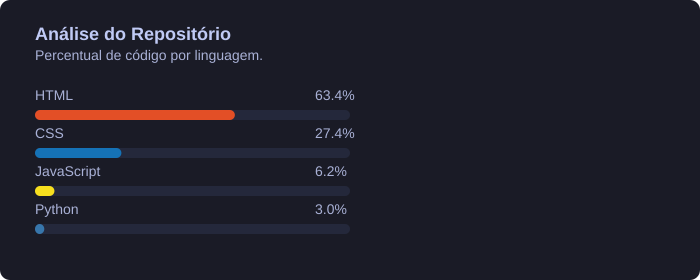

# 👨🏻‍💻 Leonardo Garcia

**`Estudante em Análise e Desenvolvimento de Sistemas e FullStack Javascript`**

Olá! Me chamo Leonardo Garcia de Oliveira, tenho 24 anos e sou natural de São Paulo. Atualmente, curso Análise e Desenvolvimento de Sistemas na UNINOVE e estou em formação como desenvolvedor Full Stack.

Tenho grande interesse por tecnologia e desenvolvimento, e estou constantemente buscando aprender e evoluir na área.
Meu objetivo é atuar como desenvolvedor Full Stack, contribuindo em projetos desafiadores, colaborativos e com foco em boas práticas de desenvolvimento ágil.

---

### 🤖 Linguagens e Tecnologias

  

 

### 📊 Estatísticas

  

